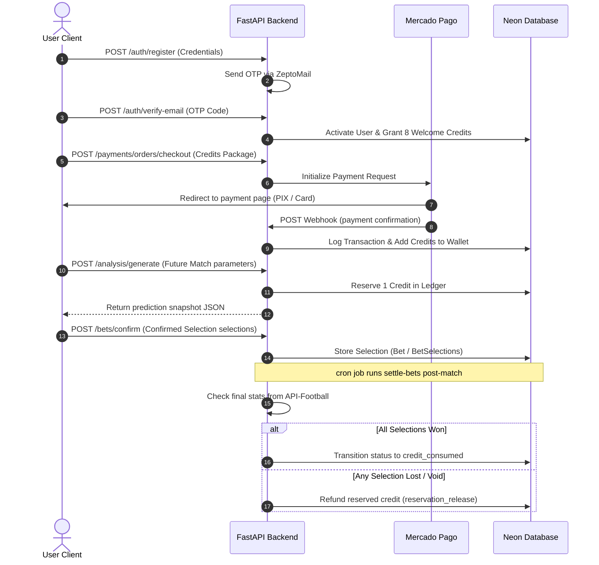

# API Flow Diagram

This diagram displays the typical workflow for user registration, credit loading, analysis generation, selection confirmation, and post-match settlement.

```mermaid
sequenceDiagram
    autonumber
    actor User as User Client
    participant API as FastAPI Backend
    participant MP as Mercado Pago
    participant DB as Neon Database

    User->>API: POST /auth/register (Credentials)
    API->>API: Send OTP via ZeptoMail
    User->>API: POST /auth/verify-email (OTP Code)
    API->>DB: Activate User & Grant 8 Welcome Credits

    User->>API: POST /payments/orders/checkout (Credits Package)
    API->>MP: Initialize Payment Request
    MP->>User: Redirect to payment page (PIX / Card)
    MP->>API: POST Webhook (payment confirmation)
    API->>DB: Log Transaction & Add Credits to Wallet

    User->>API: POST /analysis/generate (Future Match parameters)
    API->>DB: Reserve 1 Credit in Ledger
    API-->>User: Return prediction snapshot JSON

    User->>API: POST /bets/confirm (Confirmed Selection selections)
    API->>DB: Store Selection (Bet / BetSelections)

    Note over API, DB: cron job runs settle-bets post-match
    API->>API: Check final stats from API-Football
    alt All Selections Won
        API->>DB: Transition status to credit_consumed
    else Any Selection Lost / Void
        API->>DB: Refund reserved credit (reservation_release)
    end
```
