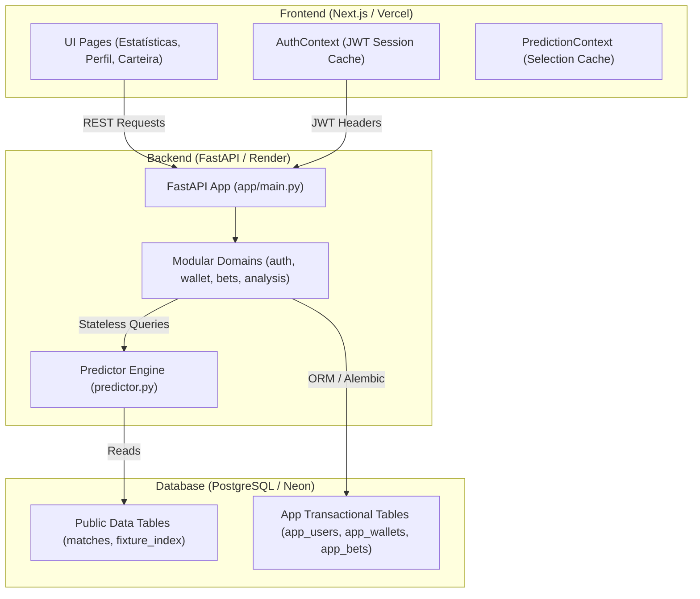

# General Architecture Diagram

This diagram displays the general Monorepo architecture and components of the Previsão de Jogos platform.

```mermaid
flowchart TD
    subgraph Frontend ["Frontend (Next.js / Vercel)"]
        UI["UI Pages (Estatísticas, Perfil, Carteira)"]
        AC["AuthContext (JWT Session Cache)"]
        PC["PredictionContext (Selection Cache)"]
    end

    subgraph Backend ["Backend (FastAPI / Render)"]
        API["FastAPI App (app/main.py)"]
        DOM["Modular Domains (auth, wallet, bets, analysis)"]
        PE["Predictor Engine (predictor.py)"]
    end

    subgraph Database ["Database (PostgreSQL / Neon)"]
        PUB["Public Data Tables (matches, fixture_index)"]
        APP["App Transactional Tables (app_users, app_wallets, app_bets)"]
    end

    UI -->|REST Requests| API
    AC -->|JWT Headers| API
    API --> DOM
    DOM -->|ORM / Alembic| APP
    DOM -->|Stateless Queries| PE
    PE -->|Reads| PUB
```
