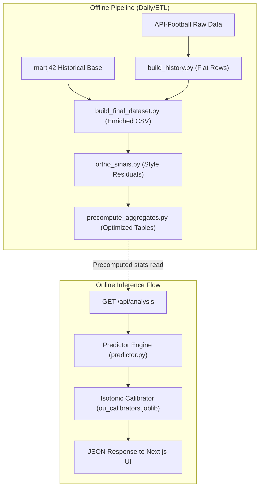

# Data Flow Diagram

This diagram displays the offline ingestion pipeline and the online prediction calculation flow.

```mermaid
flowchart TD
    subgraph Offline ["Offline Pipeline (Daily/ETL)"]
        API_F["API-Football Raw Data"]
        M42["martj42 Historical Base"]
        BH["build_history.py (Flat Rows)"]
        BFD["build_final_dataset.py (Enriched CSV)"]
        ORT["ortho_sinais.py (Style Residuals)"]
        PA["precompute_aggregates.py (Optimized Tables)"]

        API_F --> BH
        M42 --> BFD
        BH --> BFD
        BFD --> ORT
        ORT --> PA
    end

    subgraph Online ["Online Inference Flow"]
        REQ["GET /api/analysis"]
        PE["Predictor Engine (predictor.py)"]
        CAL["Isotonic Calibrator (ou_calibrators.joblib)"]
        JSON["JSON Response to Next.js UI"]

        REQ --> PE
        PA -.->|Precomputed stats read| REQ
        PE --> CAL
        CAL --> JSON
    end
```
