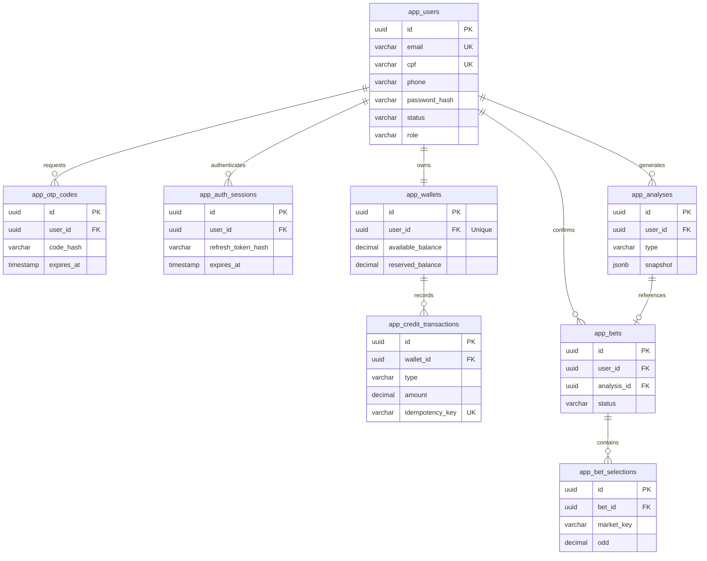

# Database Entity-Relationship Diagram

This diagram displays the key entities and relationships within the transactional database layer (`app_*`).

```mermaid
erDiagram
    app_users {
        uuid id PK
        varchar email UK
        varchar cpf UK
        varchar phone
        varchar password_hash
        varchar status
        varchar role
    }
    app_otp_codes {
        uuid id PK
        uuid user_id FK
        varchar code_hash
        timestamp expires_at
    }
    app_auth_sessions {
        uuid id PK
        uuid user_id FK
        varchar refresh_token_hash
        timestamp expires_at
    }
    app_wallets {
        uuid id PK
        uuid user_id FK "Unique"
        decimal available_balance
        decimal reserved_balance
    }
    app_credit_transactions {
        uuid id PK
        uuid wallet_id FK
        varchar type
        decimal amount
        varchar idempotency_key UK
    }
    app_analyses {
        uuid id PK
        uuid user_id FK
        varchar type
        jsonb snapshot
    }
    app_bets {
        uuid id PK
        uuid user_id FK
        uuid analysis_id FK
        varchar status
    }
    app_bet_selections {
        uuid id PK
        uuid bet_id FK
        varchar market_key
        decimal odd
    }

    app_users ||--o{ app_otp_codes : "requests"
    app_users ||--o{ app_auth_sessions : "authenticates"
    app_users ||--|| app_wallets : "owns"
    app_wallets ||--o{ app_credit_transactions : "records"
    app_users ||--o{ app_analyses : "generates"
    app_users ||--o{ app_bets : "confirms"
    app_analyses ||--o| app_bets : "references"
    app_bets ||--o{ app_bet_selections : "contains"
```
