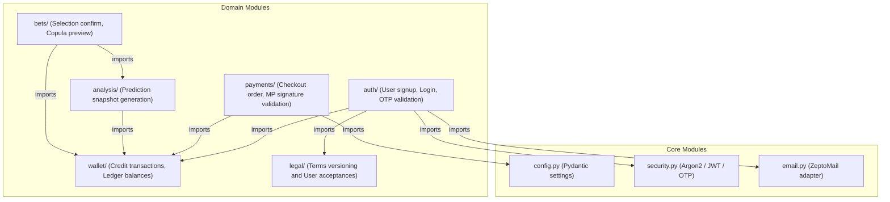

# Module Dependencies Diagram

This diagram displays the relationship and dependencies between the backend modular domains.

```mermaid
flowchart TD
    subgraph Core ["Core Modules"]
        CFG["config.py (Pydantic settings)"]
        SEC["security.py (Argon2 / JWT / OTP)"]
        EML["email.py (ZeptoMail adapter)"]
    end

    subgraph Domains ["Domain Modules"]
        AUTH["auth/ (User signup, Login, OTP validation)"]
        WAL["wallet/ (Credit transactions, Ledger balances)"]
        PAY["payments/ (Checkout order, MP signature validation)"]
        LEG["legal/ (Terms versioning and User acceptances)"]
        ANA["analysis/ (Prediction snapshot generation)"]
        BET["bets/ (Selection confirm, Copula preview)"]
    end

    AUTH -->|imports| SEC
    AUTH -->|imports| WAL
    AUTH -->|imports| LEG
    AUTH -->|imports| EML
    
    PAY -->|imports| WAL
    PAY -->|imports| CFG
    
    ANA -->|imports| WAL
    
    BET -->|imports| ANA
    BET -->|imports| WAL
```
