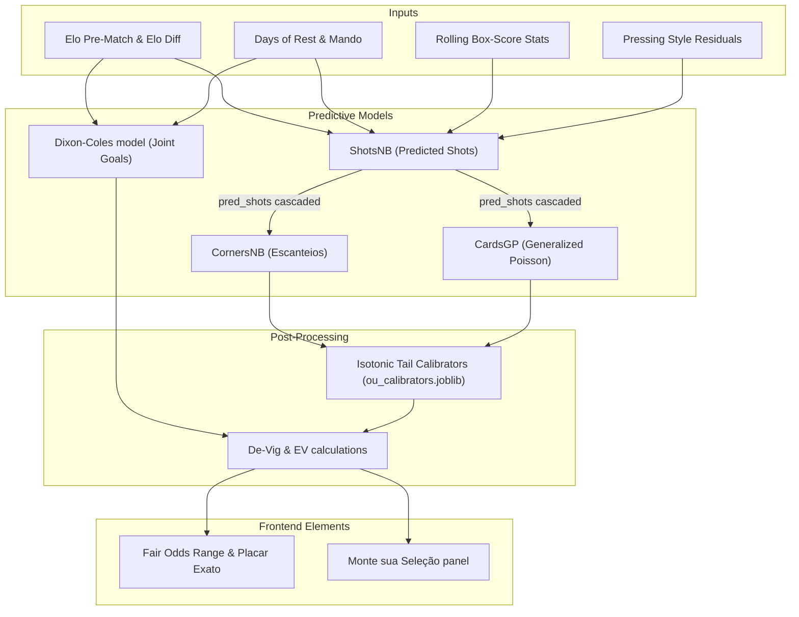

# Prediction Pipeline Diagram

This diagram displays how raw inputs are processed through our models to yield final calibrated odds.

```mermaid
flowchart TD
    subgraph Input ["Inputs"]
        ELO["Elo Pre-Match & Elo Diff"]
        REST["Days of Rest & Mando"]
        ROLL["Rolling Box-Score Stats"]
        STY["Pressing Style Residuals"]
    end

    subgraph Models ["Predictive Models"]
        DC["Dixon-Coles model (Joint Goals)"]
        SHT["ShotsNB (Predicted Shots)"]
        COR["CornersNB (Escanteios)"]
        CRD["CardsGP (Generalized Poisson)"]
    end

    subgraph Calibrators ["Post-Processing"]
        ISO["Isotonic Tail Calibrators (ou_calibrators.joblib)"]
        DEV["De-Vig & EV calculations"]
    end

    subgraph Output ["Frontend Elements"]
        UI_O["Fair Odds Range & Placar Exato"]
        UI_B["Monte sua Seleção panel"]
    end

    ELO & REST --> DC & SHT
    ROLL & STY --> SHT
    SHT -->|pred_shots cascaded| COR & CRD
    
    DC --> DEV
    COR & CRD --> ISO
    ISO --> DEV
    
    DEV --> UI_O & UI_B
```
